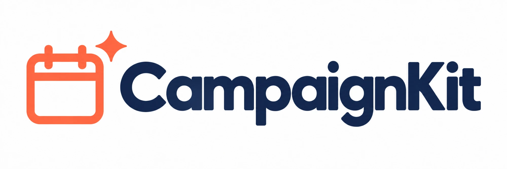

<p align="center"></p>

# CampaignKit

**One brief in. One marketing plan out.**

CampaignKit helps small business owners with no marketing team. You set up your brand once, type a short campaign brief, and get an AI-generated, editable week-by-week marketing plan for the channels you actually use, with ad scripts, designer briefs and AI images for each post.

> Course project (MVP). It runs on a shared Supabase project and will be taken down after the course.

**Live app:** https://milan-za-campaign-ki-072t.bolt.host

## What it does

- **Brand profile, saved to your account:** about you, your business (including website and logo), brand guidelines (tone, words to use and avoid, emojis, image style, colours, content language) and your marketing channels.
- **Try it with a demo:** new users can press "Use demo profile" to load the Sunrise Bakery example (marked with `brand_profiles.is_demo`). "Remove demo" clears it again and deletes only the campaigns made with it (found through `campaigns.brand_snapshot->>'is_demo'`).
- **Campaign plans:** a brief turns into a week-by-week plan (1 to 12 weeks, 2 to 3 posts a week) that only uses the channels you pick.
- **Editable posts:** change the date, channel, idea and copy. Every change saves automatically.
- **AI extras per post:** a 15 to 30-second ad script, a creative brief for a designer, and 3 images sized for the channel.
- **Previews:** see each post as it would look on Instagram, Facebook, TikTok, LinkedIn, WhatsApp, Email, Google Business Profile or an in-store poster, with a length check.
- **Use it elsewhere:** copy any text for your preferred content app, export the campaign to Excel (.xlsx) or Google Sheets (.csv), and download all images as one ZIP, organised by week.
- **Content language:** plans, copy, scripts and briefs can be written in English, French, Spanish, Portuguese, Afrikaans, isiZulu or isiXhosa (more languages coming soon).
- **Account settings** (menu under your initial, top right): see your account details, change your password, choose Light / Dark / Same as my device, see your usage, log out on all devices, or delete your account and everything in it.
- Works on phones.

## How it works

```
Claude Code / teammates ──push, pull request──► GitHub (main, protected)
                                                  │
                             ┌────────────────────┼─────────────────────┐
                             ▼ automatic          ▼ automatic           ▼ by hand
                   Check workflow        Deploy Supabase workflow     Bolt.new
                   (build + type-check)  (database + AI functions)    (import + Publish)
                                                  │                      │
                                                  ▼                      ▼
                     OpenAI ◄── AI requests ── Supabase ◄── login, data, images ── Live website ◄── users
```

| Part | Role | Updates |
| --- | --- | --- |
| **GitHub** | Single source of truth for the code | By pull request, reviewed and merged by the repo owner |
| **Check workflow** | Builds the website and type-checks the Edge Functions on every push and pull request. Required to pass before merging. | Automatic |
| **Supabase** | Login, database (brand profiles, campaigns, posts), private image storage, 3 AI functions | Automatic after a merge that changes `supabase/` |
| **OpenAI** | Writes text and creates images. Called only by the Supabase functions; the key never reaches the browser. | Model names and key are set once in Supabase |
| **Bolt.new** | Hosts the live website | By hand: bring in the latest code from GitHub, then Publish → Update |

## Current setup

| Setting | Value | Why |
| --- | --- | --- |
| Text model (`OPENAI_MODEL`) | `gpt-4.1-mini` | Doesn't need a verified OpenAI organisation |
| Image model (`OPENAI_IMAGE_MODEL`) | `dall-e-3` | Same. The code also supports `gpt-image-1` if the organisation is verified later. |
| Supabase connection | Built into `src/lib/supabase.js` | The URL and anon key are public by design (Row Level Security protects the data). Bolt did not keep a `.env` file, so the app works without one. |
| Email confirmation | Off | MVP: people can sign up and start straight away. Turn it on and add an email service before real users. |

## Working on it as a team

1. Ask the repo owner to add your GitHub account as a collaborator.
2. Create a branch (for example `yourname/new-feature`), make your change and push it.
3. Open a pull request. The **Check** workflow runs, and it must pass before merging.
4. The repo owner reviews, approves and merges.
5. After the merge, Supabase updates automatically. The owner updates the live site in Bolt.

Rules:
- **Database changes:** never edit a migration that has already run. Add a new file in `supabase/migrations/` with a later timestamp, for example `20261001090000_add_something.sql`.
- **Secrets:** never commit keys or passwords. The OpenAI key lives only in Supabase, and deploy credentials live in GitHub repository secrets. (The Supabase anon key in the code is public by design.)
- **Shared data:** everyone uses the same live database, so don't delete other people's test data.

## Run it on your computer

Needs Node 20 or newer.

```bash
npm install
npm run dev
```

Open http://localhost:5173. It connects to the shared Supabase project, so no `.env` file is needed.

## Deploy your own copy

To use your own Supabase project instead of the shared one:

1. **Supabase project:** create one at supabase.com (the free plan is fine). Note the project ref, the database password, and the URL and anon key under Project Settings → API.
2. **Database, storage and functions:**
   ```bash
   npx supabase login
   npx supabase link --project-ref YOUR-PROJECT-REF
   npx supabase db push
   npx supabase functions deploy
   npx supabase secrets set OPENAI_API_KEY=sk-... OPENAI_MODEL=gpt-4.1-mini OPENAI_IMAGE_MODEL=dall-e-3
   ```
   If you forked the repo, you can instead add the three repository secrets below and run the **Deploy Supabase** workflow from the Actions tab.
3. **Auth URLs:** in Supabase → Authentication → URL Configuration, set the Site URL to where the app runs, and add it plus `http://localhost:5173/**` to Redirect URLs.
4. **Point the website at your project:** set `VITE_SUPABASE_URL` and `VITE_SUPABASE_ANON_KEY`. Locally, copy `.env.example` to `.env.local`. On a host (Bolt, Netlify, Vercel), use environment variables; the build command is `npm run build` and the output folder is `dist`. These override the built-in defaults.

| Message you see | What's missing |
| --- | --- |
| "CampaignKit needs its Supabase settings" | The Supabase URL and anon key (step 4) |
| "This Supabase project isn't set up yet: the database tables are missing" | `supabase db push` (step 2) |
| "The AI feature … isn't set up on this Supabase project yet" | `supabase functions deploy` (step 2) |
| "The AI service is not set up yet" | The OpenAI secrets (step 2) |
| "The AI model … needs a verified OpenAI organisation" | Verify the organisation, or use `gpt-4.1-mini` and `dall-e-3` |
| Confirmation or reset email opens the wrong address | Auth URLs (step 3) |

## Automation

- `.github/workflows/check.yml`: builds the site and type-checks the Edge Functions on every push and pull request. Both jobs (`web`, `functions`) are required to merge into `main`.
- `.github/workflows/deploy-supabase.yml`: on every merge to `main` that touches `supabase/` (or by hand from the Actions tab), applies new migrations and deploys the Edge Functions. It needs the repository secrets `SUPABASE_ACCESS_TOKEN`, `SUPABASE_DB_PASSWORD` and `SUPABASE_PROJECT_ID`, and skips with a warning if they're missing.
- `public/_redirects`: sends every path to `index.html`, so refreshing any page works on the host.

## Code map

| Piece | Where |
| --- | --- |
| Theme tokens (light/dark, channel pills, preview frames) | `src/index.css` (the default Tailwind palette is disabled, so every colour comes from a token) |
| Channel list, hints, image sizes, "see first" and length limits, languages | `src/lib/channels.js` and `supabase/functions/_shared/brand.ts` |
| Brand context sent with every OpenAI request | `supabase/functions/_shared/brand.ts` → `buildBrandContext` |
| AI functions | `supabase/functions/generate-plan`, `generate-asset`, `generate-images` |
| Account settings page | `src/pages/AccountPage.jsx` and `src/components/AccountMenu.jsx` |
| Delete my account | `supabase/functions/delete-account`: removes the user's files as that user, then deletes the login with the service role key (the only place it's used); the database removes their rows by cascade |
| Campaign and posts saved all-or-nothing | RPC `create_campaign_with_items` |
| Image swap (new rows in, old rows out, in one transaction) | RPC `replace_item_images`; old files are removed only after that succeeds |
| Post previews (8 channel layouts) | `src/components/plan/PostPreview.jsx` |
| Excel/CSV export and image ZIP | `src/lib/exportCampaign.js` (runs in the browser) |
| Logo upload | `src/components/LogoUpload.jsx` (stored under `{user_id}/brand/` in the private `post-images` bucket) |
| Database schema and security rules | `supabase/migrations/` |

**Security:**
- Every table uses Row Level Security, and each user can only read and change their own rows and files.
- Edge Functions act as the logged-in user (the caller's token plus the anon key), so the same rules apply to every query and file.
- The functions always read the brand profile from the database, never from the request. `generate-plan` also stores a `brand_snapshot` copy of the profile on each new campaign.

## After the course

1. Delete the Supabase project (Project Settings → General).
2. Revoke the OpenAI API key and the Supabase access token.
3. Unpublish and delete the Bolt project.
4. Archive or delete this repository.
